Build your Filament panel **visually** with... Filament!

Crud List example:


Crud Form example:
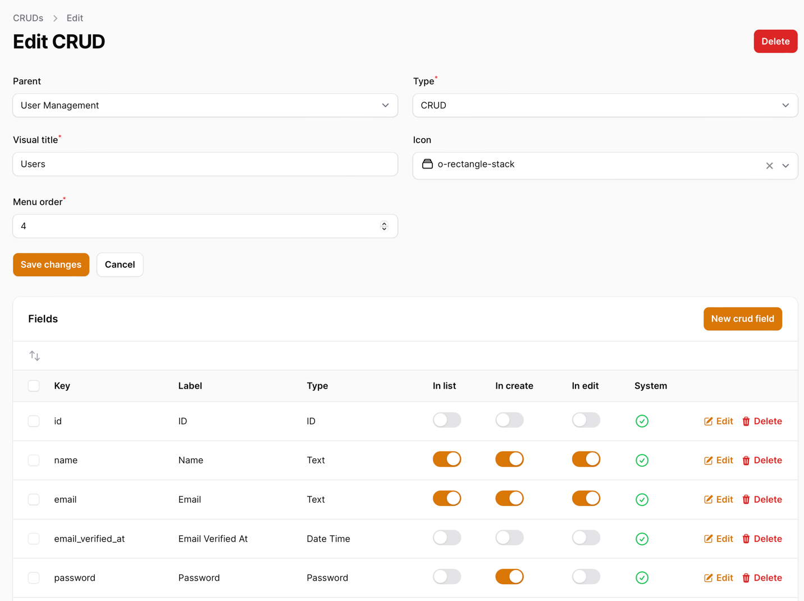

Field Form example:
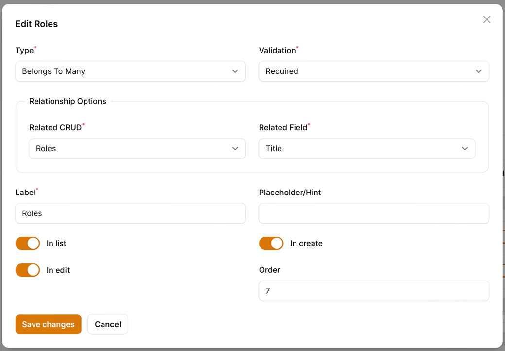

Code Generation/Download example:
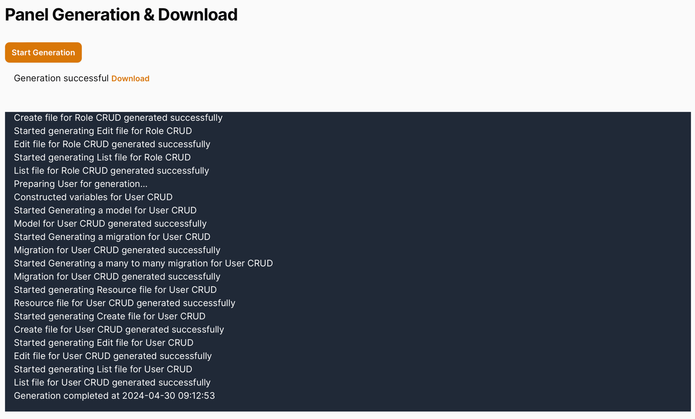

FilaStart is free and fully open-source.

---

## How it Works

FilaStart is a Laravel+Filament application that generates the code, which you should then use in your **already-existing other separate** Laravel+Filament project.

After you define your CRUDs with the visual editor, FilaStart will generate three things for you:

- Laravel Migrations
- Eloquent Models
- Filament Resources

Then, you can copy the generated files into your Laravel project and manually add more functionality.


https://github.com/LaravelDaily/FilaStart/assets/3809773/44bbf38f-12fd-40a8-a19d-b3dcbbe7c839


---

## Installation Instructions

FilaStart is a Laravel+Filament application that is installable on your local machine. **It's not a Laravel package or Filament plugin**.

The requirements are the same as those for the Laravel 11 and Filament 3 versions: the most important requirement is PHP 8.2+.

Here's the list of commands for the installation:

```sh
git clone https://github.com/LaravelDaily/FilaStart
cp .env.example .env  # Edit your .env configuration
composer install
php artisan key:generate
touch database/database.sqlite  # If you want to use SQLite
php artisan migrate --seed   # It will create a demo admin user
Launch `/admin` and log in with `admin@admin.com` and `password`
```

If you're successful, you should see a familiar Filament login screen:


---

## Usage

We know the struggle of setting up a new tool, so here is a quick overview of how to use FilaStart:

### Creating Panels

The first time you log in, you will see a "Create Panel" form appear:

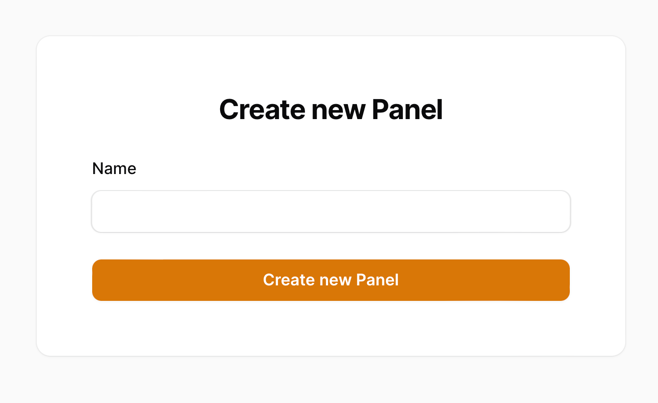

Just enter the name of your panel and click "Create Panel". This will take you to the CRUDs page:

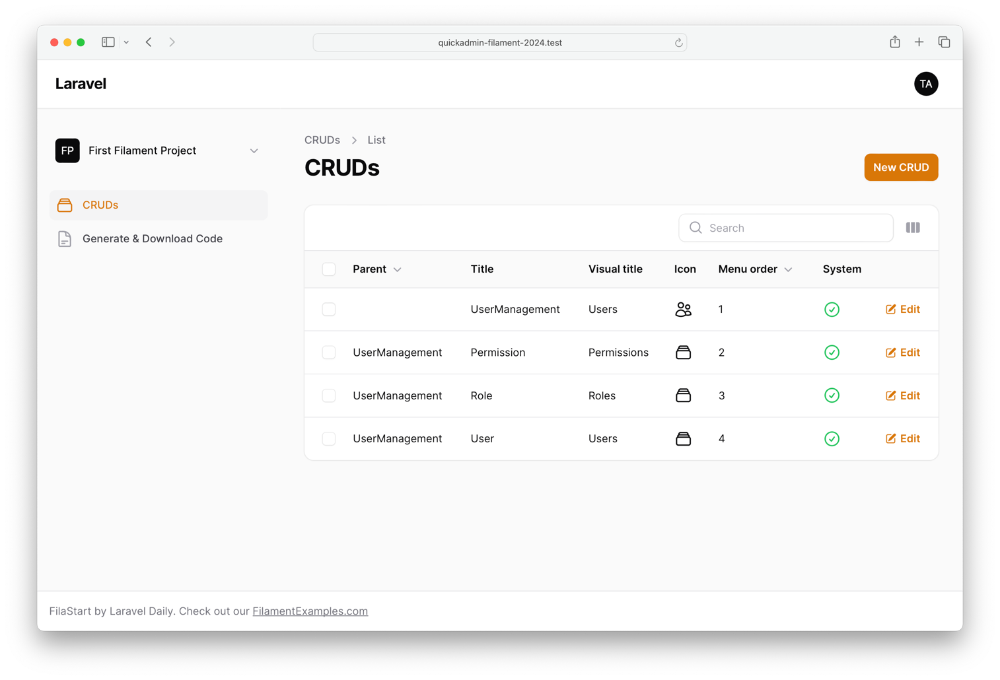

Now, if you want to create another panel, you have to click the current panel name in the top-left corner:

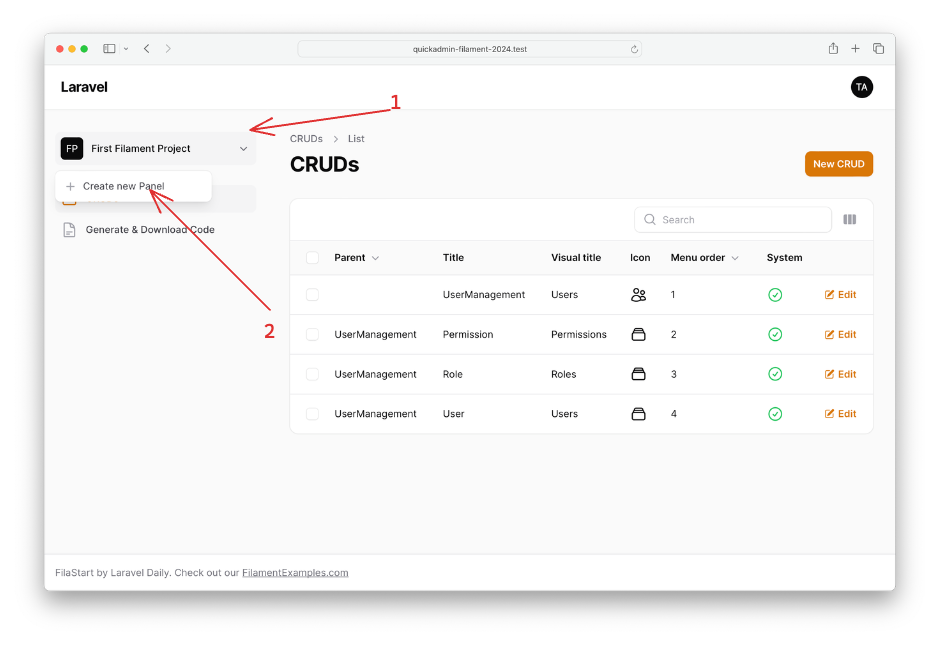

From there, it is the same process as before.

### Creating Your CRUDs

Now that we have our panel - we can create our CRUDs. Click the "New CRUD" button:

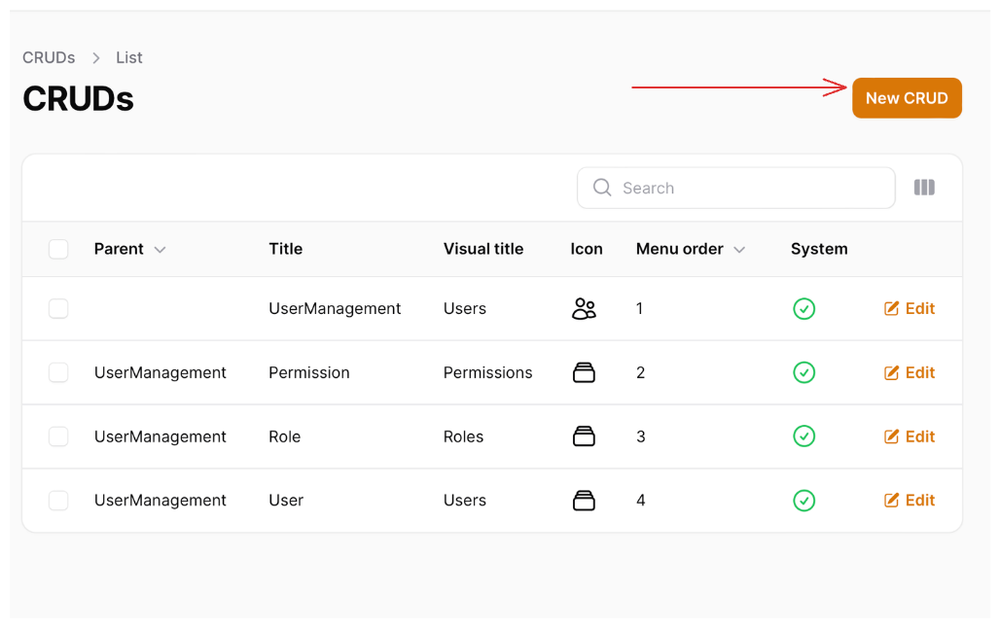

From there, fill in the details in the form:

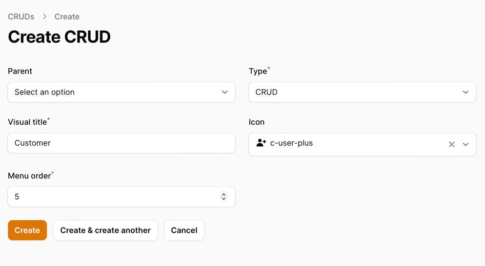

In this form, you have a few options:

- **Parent** - Select a parent CRUD here to create a sub-menu item.
- **Type** - To create a "Parent" CRUD, select the "Parent" type. Otherwise, select "CRUD" to create a Resource CRUD.
- **Visual Title** - This title will be used as your CRUDs title, and the Model name/migration table name will be auto-generated from this title.
- **Icon** - Select an icon for your CRUD. This will be used in the Filament sidebar.
- **Menu Order** allows you to order your CRUDs in the Filament sidebar.

After you fill in the form, click "Create CRUD," and you will be taken to the CRUD editor:

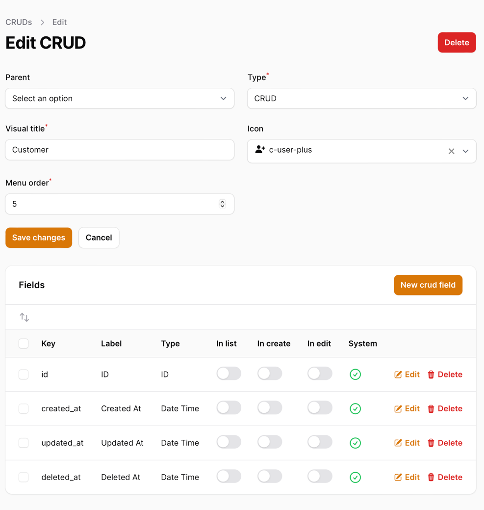

In there, you should notice that there are **four pre-defined fields**. These fields will be created for you automatically.

### Adding Fields to CRUDs

Next, we need to add fields to our CRUD. Click the "New Crud Field" button:


This will open a new Modal where you can add your field:

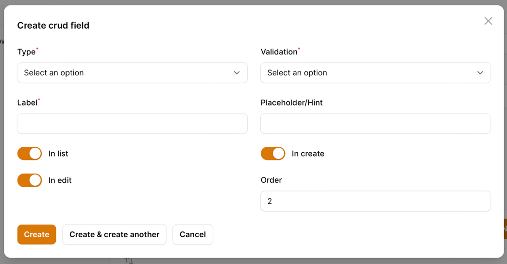

In this form, you have a few options:

- **Type** - The field type you want to add.
- **Validation** - The validation to apply to the field. Currently, only "required" and "optional" (nullable) are supported.
- **Label** - The label for the field. From this label, we will auto-generate the model field name.
- **Placeholder/Hint** - The placeholder for the field. It works for all fields except **checkbox**. For checkboxes, it's a hint.
- **Toggles for Display** - You can toggle the field to be displayed in the list view in create/edit forms.
- **Order** - The order of the field.

Of course, if the field is a relationship, you will have to select the related CRUD:

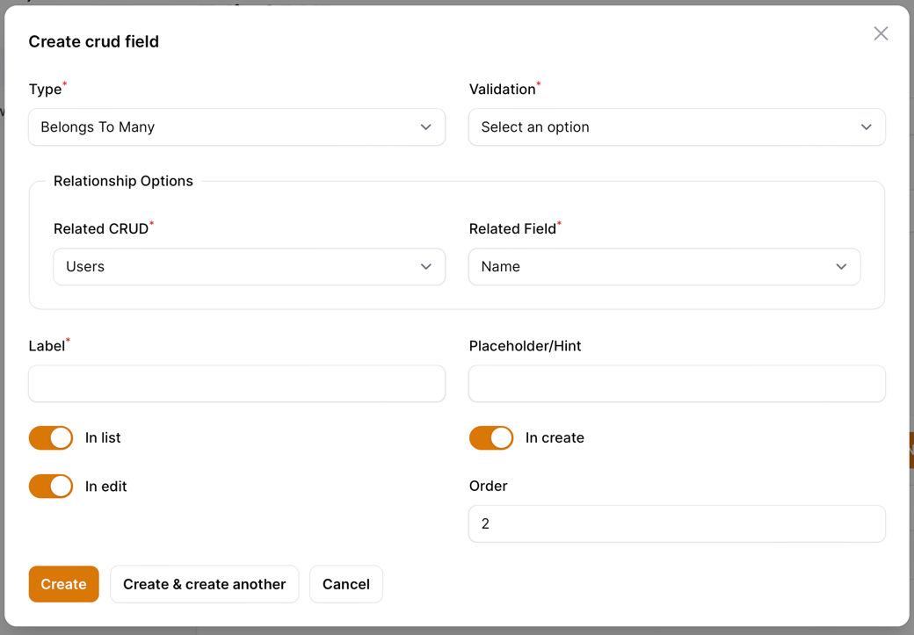

This will create a relationship between the two CRUDs.

### Downloading Generated Code

After you have created your CRUDs and fields, you can download the generated code. Click the "Generate & Download Code" link in the sidebar:

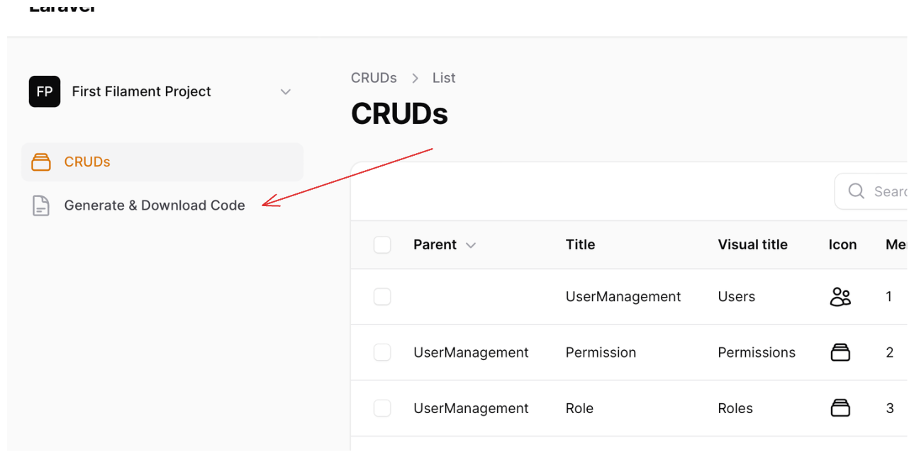

This will open a new page where you can trigger the generation of the code:

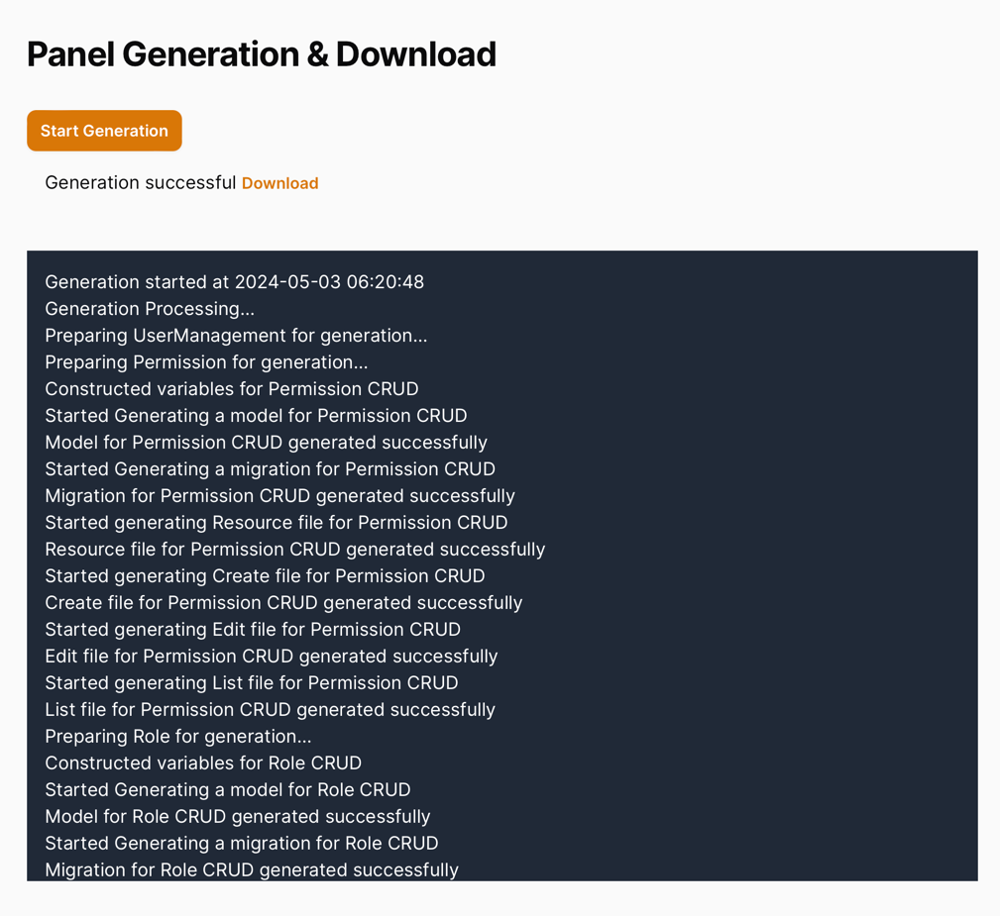

Once you've done this, you can download the generated code (or extract it from the `storage/app` folder).

To trigger the generation again (if you made changes), click the "Start Generation" button again.

---

## How to Use Generated Code

FilaStart will generate the files in three folders:

- app/Models
- database/migrations
- app/Filament/Resources

So, copy-paste the generated files into your existing Laravel + Filament project.

If it's a fresh project, overwrite those folders instead of the old ones.

If a project already contains Models and Migrations, copy only the Filament Resource files.

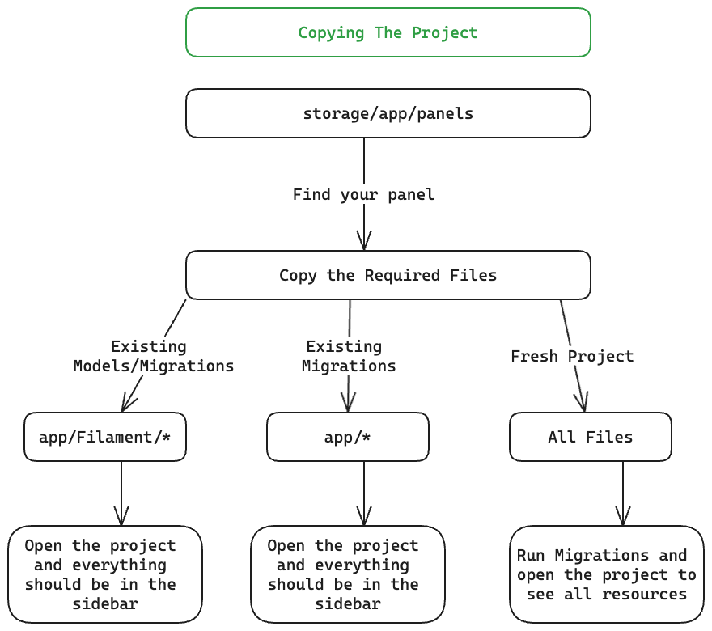

[TO-DO: another video emphasizing the copy-paste process]

---

## Extending

FilaStart comes with all Source Code, so you can extend it as you wish. Here are a few resources to get you started:

- [Enabling Modules and Adding Custom Modules](.readme/ModulesReadme.md)
- [Adding Custom Fields](.readme/CustomFields.md)
- [Modifying templates](.readme/ModifyingTemplates.md)

Feel free to dive into the source code and make changes. Everything is type-hinted, so you should be able to navigate the codebase easily.

---

## Want More Filament Examples?

FilaStart is free and open-source, but if you want to see more Filament projects in action, check out our premium product [FilamentExamples.com](https://filamentexamples.com).
